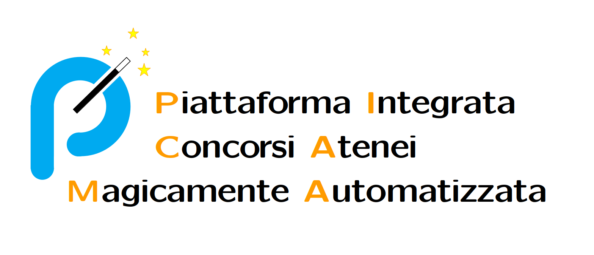

# PicaMA 🪄
### Piattaforma Integrata Concorsi Atenei Magicamente Automatizzata

🇮🇹  
PicaMA espone quotidianamente in formato RSS le opportunità lavorative presenti presso gli istituti partecipanti alla rete Pica del Cineca.  
Questo progetto non è in alcun modo affiliato con Pica od il Cineca.  

🇬🇧  
PicaMA offers a daily RSS feed containing the job opportunities available at the institutions participating in the Pica network by Cineca.  
This project is not associated in any way with Pica or Cineca.  

## List of Institutions

|logo|institution|url|git|rss|
|---|---|---|---|---|
||Accademia di Belle Arti "Mario Sironi"||||
||Accademia di Belle Arti Lecce||||
||Accademia di Belle Arti di Firenze||||
||Accademia di Belle Arti di Venezia||||
||Accademia di belle arti di Catania||||
||Agenzia Nazionale per la Meteorologia e Climatologia||||
||Alma Mater Studiorum Università di Bologna||||
||CINECA||||
||Campus BioMedico||||
||Conservatorio Statale di Musica “Stanislao Giacomantonio” - Cosenza||||
||Conservatorio di Brescia||||
||Conservatorio di Pescara||||
||Conservatorio di Salerno "Giuseppe Martucci"||||
||Conservatorio di musica "E.R Duni" Matera||||
||ENEA||||
||Gran Sasso Science Institute||||
||Human Technopole||||
||Humanitas University||||
||IMT Lucca||||
||INAF - Istituto Nazionale di Astrofisica||||
||ISIN-Ispettorato Nazionale per la Sicurezza Nucleare e la Radioprotezione||||
||IUSS - Scuola Universitaria Superiore - Pavia||||
||Istituto Nazionale di Alta Matematica - INdaM||||
||LUISS Libera Università Internazionale degli Studi Sociali "Guido Carli"||||
||Libera Università di Lingue e Comunicazione - IULM||||
||Link Campus University||||
||MUR||||
||Parco Archeologico del Colosseo||||
||Politecnico di Bari||||
||Provincia di Bolzano||||
||Regione Autonoma della Sardegna||||
||SISSA - Scuola Internazionale Superiore di Studi Avanzati||||
||Sant'Anna Scuola Universitaria Superiore Pisa||||
||Sapienza Università di Roma||||
||Scuola Nazionale dell'Amministrazione||||
||Scuola Normale Superiore di Pisa||||
||Scuola Superiore Meridionale||||
||Scuola dei beni e delle attività culturali e del turismo||||
||Università Bocconi||||
||Università Ca' Foscari Venezia||||
||Università Cattolica del Sacro Cuore||||
||Università Della Valle d'Aosta||||
||Università Europea di Roma||||
||Università Iuav di Venezia||||
||Università Telematica Mercatorum||||
||Università Telematica Pegaso||||
||Università Vita-Salute San Raffaele||||
||Università degli Studi "Gabriele d'Annunzio"  - Chieti-Pescara||||
||Università degli Studi "Magna Graecia" di Catanzaro||||
||Università degli Studi del Piemonte Orientale||||
||Università degli Studi dell'Aquila||||
||Università degli Studi dell'Insubria||||
||Università degli Studi della Basilicata||||
||Università degli Studi della Campania "Luigi Vanvitelli"||||
||Università degli Studi di Bari Aldo Moro||||
||Università degli Studi di Bergamo||||
||Università degli Studi di Brescia||||
||Università degli Studi di Cagliari||||
||Università degli Studi di Macerata||||
||Università degli Studi di Messina||||
||Università degli Studi di Napoli "L'Orientale"||||
||Università degli Studi di Napoli Federico II||||
||Università degli Studi di Napoli PARTHENOPE||||
||Università degli Studi di Padova||||
||Università degli Studi di Palermo||||
||Università degli Studi di Parma||||
||Università degli Studi di Perugia||||
||Università degli Studi di Roma "Tor Vergata"||||
||Università degli Studi di Salerno||||
||Università degli Studi di Sassari||||
||Università degli Studi di Siena||||
||Università degli Studi di Teramo||||
||Università degli Studi di Urbino Carlo Bo||||
||Università degli studi della Repubblica di San Marino||||
||Università degli studi di Cassino e del Lazio Meridionale||||
||Università degli studi di Foggia||||
||Università degli studi di Pavia||||
||Università della CALABRIA||||
||Università di Camerino||||
||Università di Ferrara||||
||Università di Milano Bicocca||||
||Università di Modena e Reggio Emilia||||
||Università di Pisa||||
||Università di Torino||||
||Università di Trieste||||
||Università di Udine||||
||Università di Verona||||
||Università ecampus||||
||Università per Stranieri di Perugia||||
||Università per Stranieri di Siena||||
