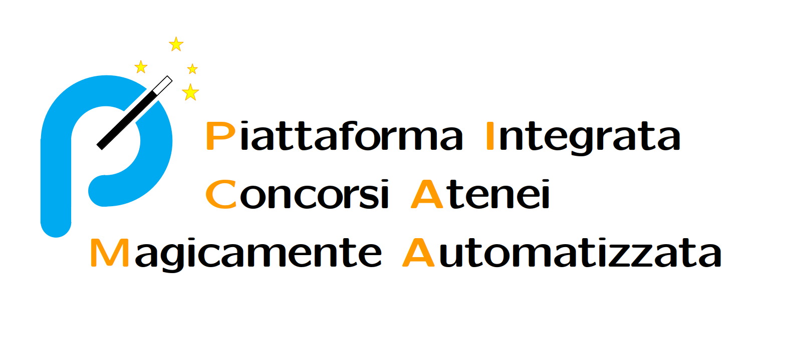

# PicaMA 🪄
### Piattaforma Integrata Concorsi Atenei Magicamente Automatizzata

🇮🇹  
PicaMA espone quotidianamente in formato RSS le opportunità lavorative presenti presso gli istituti partecipanti alla rete Pica del Cineca.  
Questo progetto non è in alcun modo affiliato con Pica od il Cineca.  

🇬🇧  
PicaMA offers a daily RSS feed containing the job opportunities available at the institutions participating in the Pica network by Cineca.  
This project is not associated in any way with Pica or Cineca.  

## List of Institutions

|logo|institution|url|git|rss|
|---|---|---|---|---|
